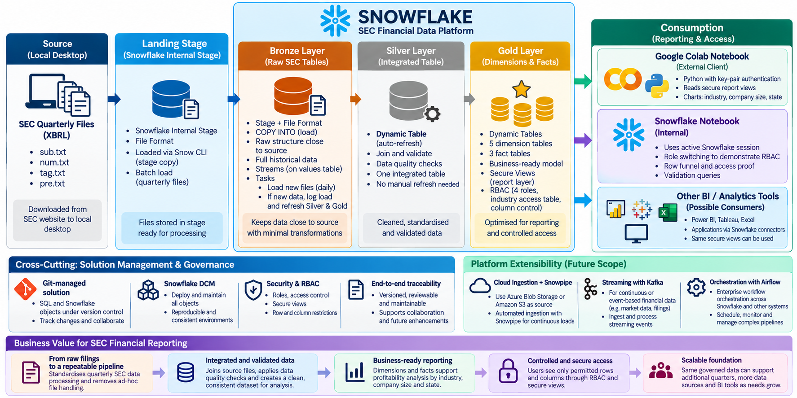
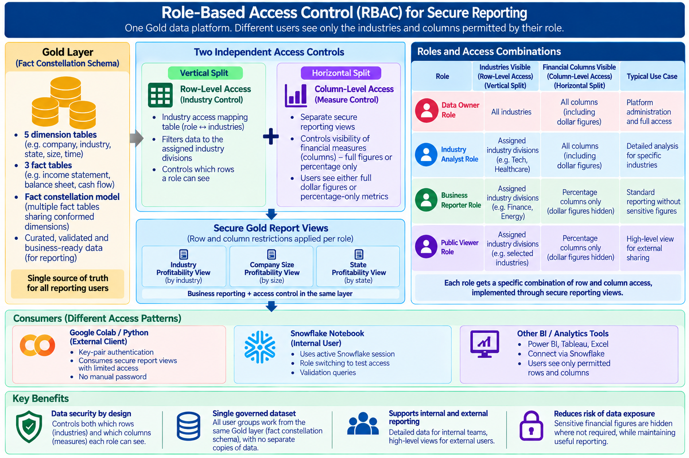

## Architecture & Secure Reporting

This project turns raw SEC quarterly filings into a governed, business-ready reporting layer on Snowflake. It uses a medallion architecture (Bronze → Silver → Gold), is fully version-controlled and deployed as code, and applies role-based access control down to the row and column level.

### Platform Architecture

The pipeline follows an **ELT** design rather than ETL. Data is loaded into Snowflake first, in its original shape, and every transformation happens afterwards, inside the platform, where it's easy to audit and re-run.

- **Source → Landing Stage.** The four SEC XBRL tables (`sub`, `num`, `tag`, `pre`) are downloaded as quarterly zip releases. They are staged into a Snowflake internal stage using the Snow CLI, with no reshaping before they land.
- **Bronze layer.** Raw structure, kept as close to source as possible. `COPY INTO` handles the batch load, and **Streams** track new rows arriving in the values table. A **Task** is designed to check daily for new data and trigger a downstream refresh automatically, so incremental loading does not need a manual reload each quarter.
- **Silver layer.** A single integrated table, built as a **Dynamic Table**. It joins and validates the four source tables and refreshes itself automatically as Bronze changes, with no manual orchestration. Data quality checks are applied here, so everything downstream reads from one clean, standardised source of truth.
- **Gold layer.** A **fact constellation schema** with five conformed dimensions (company, industry, state, filer size, time) shared across three fact tables (income statement, balance sheet, cash flow). All of these are self-refreshing Dynamic Tables. This is also where **secure reporting views** and RBAC are applied, so the same governed model serves every consumer without separate copies of the data.
- **Consumption.** Google Colab connects externally using key-pair authentication, with no password stored anywhere. The Snowflake Notebook runs internally and uses the active Snowflake session, switching roles in-session to validate access. Other BI tools, such as Power BI, Tableau or Excel, could connect the same way through Snowflake's own connectors, inheriting the same row and column restrictions automatically.

Everything above is **Git-managed and deployed through Snowflake DCM** (Database Change Management). Every table, view, role and grant is defined as version-controlled SQL and deployed the same way each time, so the environment is reproducible and reviewable rather than built by hand. A dedicated data-owner view also performs **source-to-target reconciliation**, counting rows at every filter step from Bronze through Silver to Gold, so any drop in row counts can be traced back to a specific rule.

### Role-Based Access Control (RBAC) for Secure Reporting

Rather than creating separate copies of the data for different audiences, this design applies **two independent access controls** directly on top of the single Gold fact constellation:

- **Vertical split — row-level access.** An industry-access mapping table ties each role to the industry divisions it is allowed to see. The same query then returns a different, correctly filtered slice of rows depending on who is running it.
- **Horizontal split — column-level access.** A second set of secure views controls which financial measures are exposed, either full dollar figures or percentage-only metrics. This allows sensitive figures to be hidden without hiding the underlying trend.

Combined, these two controls produce four distinct access profiles, all served from the same governed Gold layer through secure reporting views:

| Role | Industries visible (row-level) | Financial columns visible (column-level) | Typical use case |
|---|---|---|---|
| **Data Owner** | All industries | All columns, including dollar figures | Platform administration and full access |
| **Industry Analyst** | Assigned industry divisions (e.g. Tech, Healthcare) | All columns, including dollar figures | Detailed analysis for specific industries |
| **Business Reporter** | Assigned industry divisions (e.g. Finance, Energy) | Percentage columns only (dollar figures hidden) | Standard reporting without sensitive figures |
| **Public Viewer** | Assigned industry divisions (e.g. selected industries) | Percentage columns only (dollar figures hidden) | High-level view for external sharing |

Three secure Gold report views — Industry Profitability, Company Size Profitability, and State Profitability — apply these row and column restrictions automatically. Business reporting and access control therefore live in the same layer, rather than being added on afterwards.

**Why it matters:** the same governed dataset supports both internal, detailed analysis and external, high-level sharing, from a single source of truth. There is no duplicated data, no manual permission scripts per report, and a much lower risk of an over-privileged view exposing a figure it should not.
